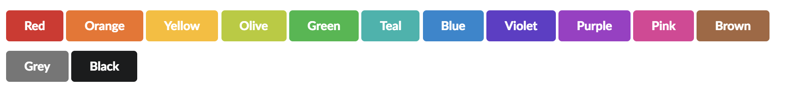
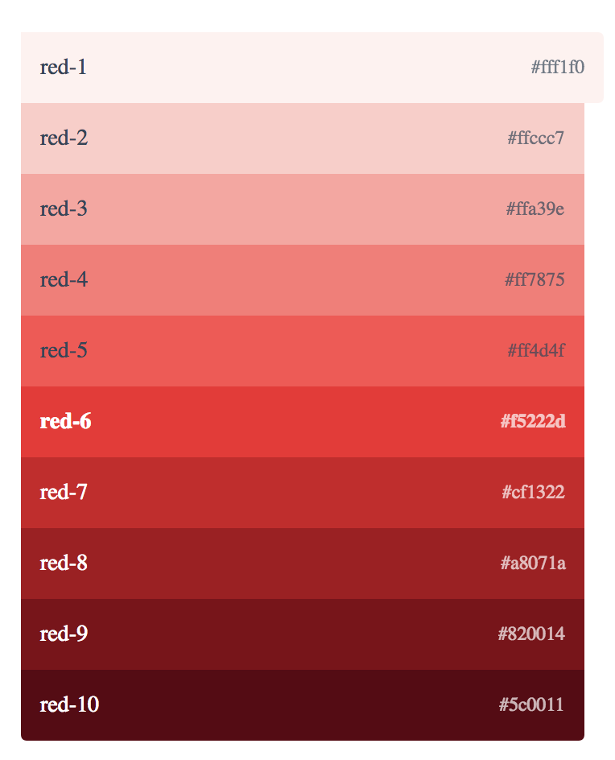

# Color Variables

## Basic Color Variables

* color-red
* color-orange
* color-yellow
* color-olive
* color-green
* color-blue
* color-violet
* color-purple
* color-pink
* color-brown
* color-grey
* color-black

## Example Settings

* color-red = \#f5222d
* color-orange = \#fa8c16
* color-yellow = \#fff566
* color-olive = \#bae637
* color-green = \#52c41a
* color-teal = \#36cfc9
* color-blue = \#1890ff
* color-violet = \#722ed1
* color-purple = \#d3adf7
* color-pink = \#eb2f96
* color-brown = \#8e300e
* color-grey = \#bfbfbf
* color-black = \#000000

## Example Red Shade Settings

* color-red = \#f5222d \(default\)
* color-red-1 = \#fff1f0
* color-red-2 = \#ffccc7
* color-red-3 = \#ffa39e
* color-red-4 = \#ff7875
* color-red-5 = \#ff4d4f
* **color-red-6 \(default\) = \#f5222d**
* color-red-7 = \#cf1322
* color-red-8 = \#a8071a
* color-red-9 = \#820014
* color-red-10 = \#5c0011

