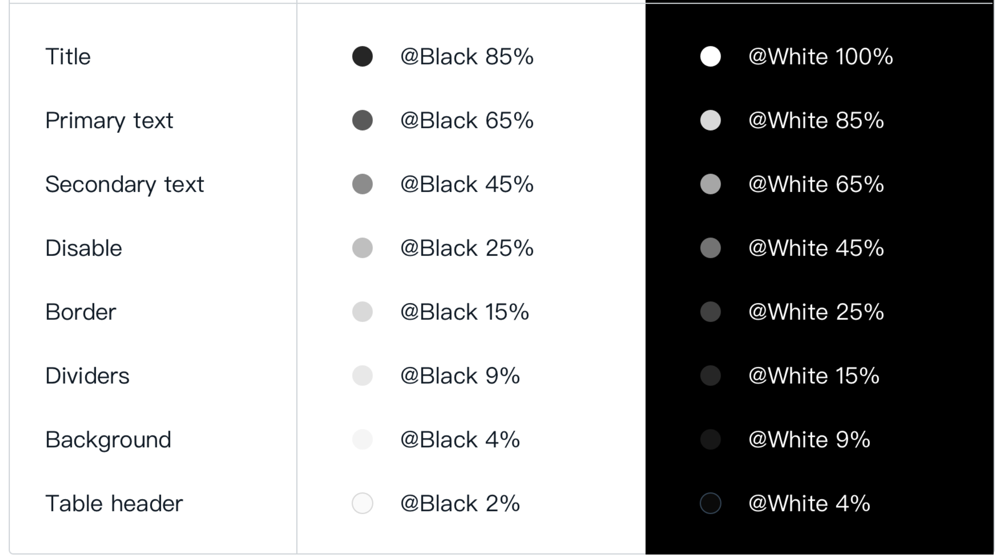

# Font Color Related

## Variable Names:

* color-title
* color-text-primary
* color-text-secondary
* color-disable
* color-border
* color-dividers
* color-background
* color-table-header

## Example Variable Settings

