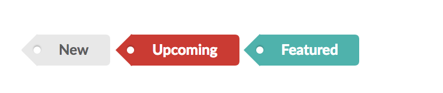

# app-label

## Component Name

app-label

## Component Parameters

* type
* location \(left, top-left, bottom-left, left-top, top, right-top, etc.\)
* size

## Example type settings

For label type, designer may choose a label name descriptive to the label type.  A few examples are shown below.

### type='input'

A basic label for form input

### type='data'

A basic label for a piece of data or information

### type='icon'

A basic label to the right of an icon. \(23 labels the icon\)

### type='pointing'

Labels an input or something.

### type='tag'

### type='ribbon'

### type='corner'

### type='attached'

### type='floating'

