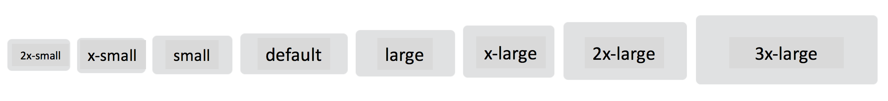

# app-button

## Accepted Parameters

* appType
* appSize
* appShape
* appIsLoadin
* appCorners

## Size Examples

```text
<app-button size="3x-large">3x-large</app-button>
<app-button size="2x-large">2x-large</app-button>
<app-button size="x-large">x-large</app-button>
<app-button size="large">large</app-button>
<app-button size="default">default</app-button>
<app-button size="small">small</app-button>
<app-button size="x-small">x-small</app-button>
<app-button size="2x-small">2x-small</app-button>
```




